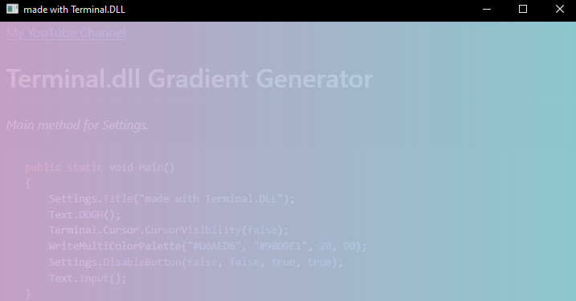

[My YouTube Channel](https://www.youtube.com/@prabex)


# Terminal.dll Gradient Generator

Opacity %88



_Main method for Settings._

````c#
 public static void Main()
 {
     Settings.Title("made with Terminal.DLL");
     Text.DDGH();
     Terminal.Cursor.CursorVisibility(false);
     WriteMultiColorPalette("#D6AED6", "#98D9E1", 20, 90);
     Settings.DisableButton(false, false, true, true);
     Text.Input();
 }
````

- ````Settings.Title("made with Terminal.DLL");```` for set title
- ````Text.DDGH();```` for get console handle
- ````Terminal.Cursor.CursorVisibility(false);```` for make cursor invisible
- ```` WriteMultiColorPalette("#D6AED6", "#98D9E1", 20, 90);```` Method for gradient color
- ```` Settings.DisableButton(false, false, true, true);```` Disable maximize,resize,minimize and close button
- ````  Text.Input();```` Same as ````Console.ReadLine();````

_Other methods._

````c#
 public static void WriteMultiColorPalette(string color1, string color2, int rows, int columns)
 { 
     int steps = columns;
     int stepSize = 255 / steps;

     int[] rgb1 = HexToRgb(color1);
     int[] rgb2 = HexToRgb(color2);

     for (int row = 0; row < rows; row++)
     {
         Settings.WindowSize(90, 20);
         Console.SetBufferSize(90, 20);
         for (int col = 0; col < columns; col++)
         {
             double ratio = (double)col / columns;
             int r = (int)(rgb1[0] * (1 - ratio) + rgb2[0] * ratio);
             int g = (int)(rgb1[1] * (1 - ratio) + rgb2[1] * ratio);
             int b = (int)(rgb1[2] * (1 - ratio) + rgb2[2] * ratio);
             WriteGradientConsole($" ", r, g, b);
         }
         if(row + 1 != rows)
         {
             Text.NewLine();
         }
     }
 }    
 public static int[] HexToRgb(string hex)
 {
     hex = hex.TrimStart('#');
     return new int[] {
     Convert.ToInt32(hex.Substring(0, 2), 16),
     Convert.ToInt32(hex.Substring(2, 2), 16),
     Convert.ToInt32(hex.Substring(4, 2), 16)
 };
 }

 public static void WriteGradientConsole(string text,int r, int g, int b)
 {
     Text.DDGH();
     Text.Write($"\x1b[48;2;{r};{g};{b}m{text}\x1b[0m");
 }
````
